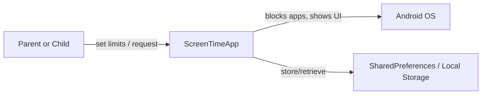

# Diagrams for the app: Use Case Diagram and Data Flow Diagram

File: [`app/diagrams/diagrams.md`](app/diagrams/diagrams.md:1)

## Use Case Diagram (high-level)

```mermaid
%%{init: {'theme':'base', 'themeVariables':{ 'primaryColor':'#0b5cff'}}}%%
usecaseDiagram
actor Parent as P
actor Child as C
rectangle App {
  P --> (Onboard)
  P --> (Select apps to monitor)
  P --> (Set time limits)
  P --> (View usage stats)
  C --> (Use device apps)
  C --> (Request extra time)
  C --> (Solve math challenge)
  (Use device apps) --> (Trigger blocking)
  (Trigger blocking) --> (Show blocking screen)
  (Request extra time) --> (Solve math challenge)
  (Solve math challenge) --> (Grant extra time)
}
```

## Data Flow Diagram - Level 0 (Context)



## Data Flow Diagram - Level 1 (processes, data stores)

```mermaid
graph TD
  subgraph P1[1. Usage Monitoring]
    A[Get foreground app] --> B[Update usage counters]
    B --> Storage[(Usage data store)]
  end

  subgraph P2[2. Blocking Decision]
    C[Check time limits] --> D{Exceeded?}
    D -- yes --> E[Trigger blocking UI/service]
    D -- no --> F[Allow app usage]
    E --> Overlay[OverlayBlockingService]
    E --> BlockingActivity[BlockingActivity]
  end

  subgraph P3[3. Time Increase Flow]
    G[User requests extra time] --> H[Math Challenge or AddTime Activity]
    H -- success --> I[Increase time limit in Storage]
    I --> P2
  end

  Storage[(SharedPreferences / time_limits, usage, selected apps)]
  User[Parent or Child] -->|configure| P3
  Device[Android OS] -->|foreground events| P1
  P1 --> P2